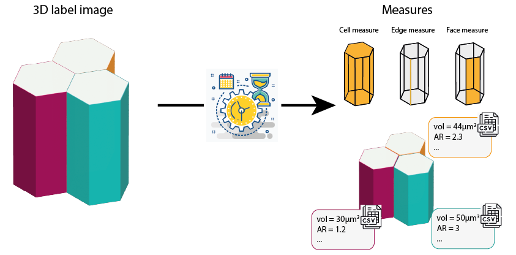

# CellSeg
A generalist algorithm for cell segmentation from 3D labeled image. 

 

This code is made to analyse cells from 3D labeled image. We determine edges and faces associated to each cell. Quality of this analysis is dependant of the quality of the labeled image. There is no segmentation correction.

There is a Python API to allow user to integrate CellSeg into your custom workflow.  
There is a Napari plugin for interacting graphically with CellSeg tool. -- Coming soon --

## Segmentation output
Segmentation part generate 7 csv files, that can be populated later during the analysis part.
- __cell_plane_df.csv__ contains measure relative to the cell, such as volume, number of neighbours, orientation, curvature
- __cell_plane_df.csv__ contains plane measure, such as orientation, anisotropy, area, perimeter
- __edge_df.csv__ contains measure relative to the edge such as length (real & shortest), curvature, the 3 connected cells
- __edge_pixel_df.csv__ contains pixels coordinates of each edge and the 3 connected cells
- __face_df.csv__ contains coordinates of the middle of the face, the lengths, the angles
- __face_edge_pixel_df.csv__ contains coordinates of the edges associated to the face, and the coordinates of the middle of the face
- __face_pixel_df.csv__ contains pixels coordinates of each face and the 2 connected cells and edges

 

## From Prerequisite part  

It creates two folders names "npz" and "obj_mesh" that stores numpy array of binary one cell image and ply/obj file of each cell respectively. npz file are mandatory for the analyse, while obj_mesh allows to visualise cells in 3D with Blender. All files are named after the cell id in the original image. 

## Analysis

### Cell information (cell_df.csv)
- Volume $vol_c=nb_{pixel}*voxel_{size}$
- Coordinate of line in the middle of the cell : $mid_{line}$
- Real distance of $mid_{line}$ : $D_r$
- Short distance of $mid_{line}$ : $D_s$
- Curvature index $1-(D_s/D_r)$

 

### Cell plane information (cell_plane.csv)
Plane measure :
- Anisotropy $major/minor$
- Orientation $\alpha = arctan2(y_orient/x_orient)$
- Area
- Perimeter

 

### Edge information (edge_df.csv)
- Real distance $D_r$
- Short distance $D_s$
- Curvature index $1-(D_s/D_r)$
<!--
- Rotation angle $A_{rot}$
  * Cell centre as reference, choose xy coordinate as the same z plane as the edge coordinate
  * Value is more or less approximate depending of the cell orientation compare to z axis, but it will be fix soon

 

### Cell information - required edge information
- Measure cell twist ( !!! All edges are used to do the average, but they don't have the same length. Maybe we need to weigh values)

 

-->
### Face information (face_df.csv)
- Only lateral face (coloured face in scheme)
- id of cell1 & cell2
- id of edge1 & edge2
- Centre of the face
- Width
- Angles (reference: centre of the face)

 

## Install 

See [INSTALL.md](INSTALL.md) for a step by step install. 