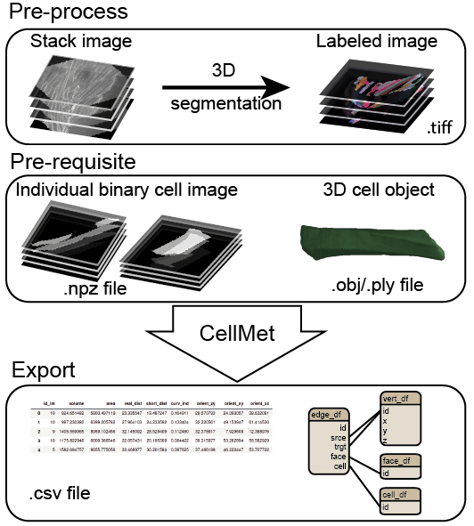

# CellMet
A generalist algorithm to analyse cell shape from 3D labeled image. 

 

This code is made to analyse cell shape from 3D labeled image. It is divide in three parts:
- Prerequisite that will create image containing one cell. This is mandatory to fasten the following analysis. 
- We determine edges and faces associated to each cell. Quality of this analysis is dependant of the quality of the labeled image. There is no segmentation correction.
- Analysis of cells, faces and edges. 

There is a Python API to allow user to integrate CellMet into your custom workflow.

## Input/Output and datas organisation
### Input
In order to be able to use this project. You first need to segment you image using CellPose (or any other software that gives 3D label image). You need to be satisfied by your label image, since there is no manual correction (only filter can be apply to remove cells that has a volume below a threshold for example).  
Then, you can perform 3D cell segmentation with CellMet. 

### Output and datas organisation
You can generate ply/obj file for each cells.  
<table>
<tr>
<td  width="500">
Datas are organised as half-edge structures. The vertex, edge, face and cell tables are interconnected to represent and navigate through the mesh's elements. 
</td>
<td >

</td>
</tr>
</table>
We generate 7 csv files, that can be populated later during the analysis part.
- __cell_df.csv__ contains measure relative to the cell, such as volume, number of neighbours, orientation, curvature
- __cell_plane_df.csv__ contains plane measure, such as orientation, anisotropy, area, perimeter
- __edge_df.csv__ contains measure relative to the edge such as length (real & shortest), curvature, the 3 connected cells
- __edge_pixel_df.csv__ contains pixels coordinates of each edge and the 3 connected cells
- __face_df.csv__ contains coordinates of the middle of the face, the lengths, the angles
- __face_edge_pixel_df.csv__ contains coordinates of the edges associated to the face, and the coordinates of the middle of the face
- __face_pixel_df.csv__ contains pixels coordinates of each face and the 2 connected cells and edges

 

## Prerequisite  
It creates two folders names "npz" and "obj_mesh" that stores numpy array of binary one cell image and ply/obj file of each cell respectively. npz file are mandatory for the analyse, while obj_mesh allows to visualise cells in 3D with Blender. All files are named after the cell id in the original image. 

## Segmentation
This part consists of analysing the labelled image in order to determine neighbouring relationship between cells; contact between two cells (i.e. face); contact between three cells (i.e. edge). 

 

## Analysis

### Cell information (cell_df.csv)
<table>
<tr>
<td>
<li>Volume $vol_c=nb_{pixel}*voxel_{size}$</li>
<li>Coordinate of line in the middle of the cell : $mid_{line}$</li>
<li>Real distance of $mid_{line}$ : $D_r$</li>
<li>Short distance of $mid_{line}$ : $D_s$</li>
<li>Curvature index $1-(D_s/D_r)$</li>
</td>
<td>

 

</td>
</tr>
</table>

### Cell plane information (cell_plane.csv)
<table>
<tr>
<td>
Plane measure :
<li>Anisotropy $major/minor$</li>
<li>Orientation $\alpha = arctan2(y_orient/x_orient)$</li>
<li>Area</li>
<li>Perimeter</li>
</td>
<td>

 

</td>
</tr>
</table>

### Edge information (edge_df.csv)
- Real distance $D_r$
- Short distance $D_s$
- Curvature index $1-(D_s/D_r)$

<!-- 
- Rotation angle $A_{rot}$
  * Cell centre as reference, choose xy coordinate as the same z plane as the edge coordinate
  * Value is more or less approximate depending of the cell orientation compare to z axis, but it will be fix soon

 

### Cell information - required edge information
- Measure cell twist ( !!! All edges are used to do the average, but they don't have the same length. Maybe we need to weigh values)

 

-->

### Face information (face_df.csv)
<table>
<tr>
<td>
:warning: Only lateral face (coloured face in scheme)  
<li>id of cell1 & cell2</li>
<li>id of edge1 & edge2</li>
<li>Centre of the face</li>
<li>Width</li>
<li>Angles (reference: centre of the face)</li>
</td>
<td>

 

</td>
</tr>
</table>

## Install 

See [INSTALL.md](INSTALL.md) for a step by step install. 
A datasets to test the program can be found [here](https://doi.org/10.5281/zenodo.14177750). 

<!--
## Graphical user interface
There is a graphical interface in progress. You can try it by running notebook [GUI.ipynb](https://github.com/sophietheis/Zebrafish-Muscle/blob/main/notebooks/GUI.ipynb).
A graphical user interface is available to perform the analysis.  
Be aware that analysis takes time.  
Prerequisite are necessary to perform the analysis. It performs 3D distance mapping EDT algorithm to find the middle of the cell (this can also be perform with an imageJ script), and save one binary image per cell to speed up analysis.

There are two ways of launching the GUI : 
- run [GUI.ipynb](https://github.com/sophietheis/Zebrafish-Muscle/blob/main/notebooks/GUI.ipynb) notebook
- run in command line `python CellMet/export_gui.py`
-->

## Troubleshooting
Kernel crash due to lack of memory: reduce the number of core used for parallelized task. 

## Roadmap
- Add GUI with python or as a Napari plugin
